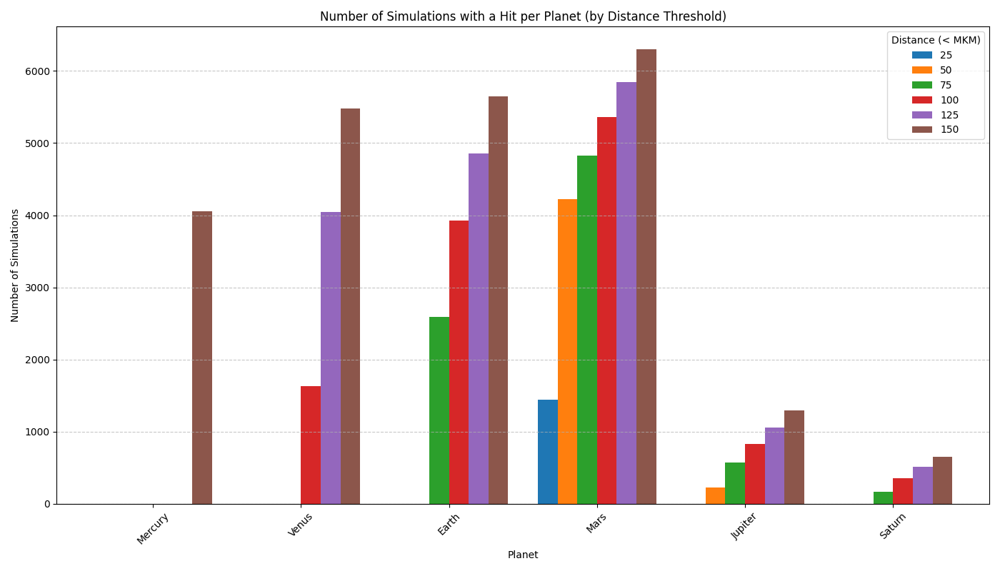
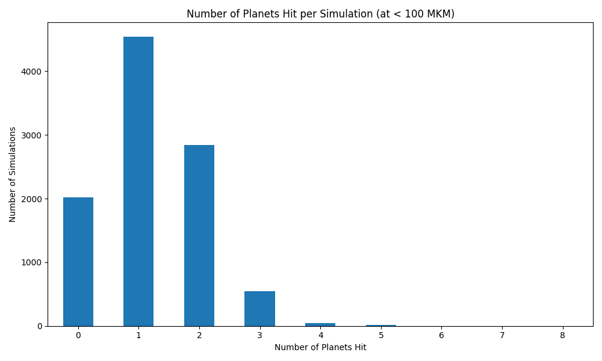

# 3I/ATLAS Monte Carlo Simulation Results

## 1. Probability Analysis: Pre-hoc vs. Post-hoc Perspectives

A critical distinction in this analysis is between the probability of a *specific* event and the probability of *any* event of a certain class.

### The 'Any 3+ Planet' Baseline (Meaningful Pre-hoc Probability)
To assess if 3I/ATLAS is truly anomalous, we must first look at how often any comet with its orbital parameters would pass within 'tens of millions of kilometers' (< 100 million km) of any 3 or more planets. This represents the background probability of a multi-planet encounter.

| Multi-Planet Encounter Class | Probability (at < 100 MKM) |
| --- | --- |
| At least 3 planets | 0.0603 (603 in 10000) |
| At least 4 planets | 0.0055 (55 in 10000) |
| At least 5 planets | 0.0015 |

In our simulation of 10000 trials, **603 simulations** resulted in a close approach to 3 or more planets within 100 million km. This suggests that while multi-planet encounters are not the default, they are a statistically significant possibility (approx. 6.0%) for this specific orbit.

### The Specific 3I/ATLAS Anomaly (Post-hoc Configuration)
The 'Joint P-value' calculated below (0.000400) measures the probability of hitting Venus, Mars, and Jupiter at their *exact* observed proximities simultaneously. While this value is extremely low, it is a **post-hoc probability**—it measures the rarity of a specific outcome after it has already occurred. When viewed against the broader 6.0% chance of hitting *any* three planets, the observed configuration is less of a statistical impossibility and more of a specific (albeit very precise) instance of a broader class of multi-planet encounters.

| Planet | Actual Min Distance (AU) | Individual P-value |
| --- | --- | --- |
| Venus | 0.6512 | 0.1097 |
| Mars | 0.1942 | 0.1826 |
| Jupiter | 0.3586 | 0.0297 |

**Joint P-value for observed Venus-Mars-Jupiter config: 0.000400**

## 2. Conclusion

The trajectory of 3I/ATLAS is undoubtedly 'fine-tuned' in the sense that it occupies a very small volume of the possible parameter space. However, it should be reported that:
1. There is a **6.0% chance** for this interstellar object to pass within 100 million km of at least 3 planets.
2. The specific configuration observed is a particularly close and 'clean' version of these possible multi-planet passes, but its significance should be weighed against the background probability of multi-planet encounters for this orbit.

## 3. Visualizations

### Hits per Planet (by Distance Threshold)

### Hits per Simulation (at 100 MKM threshold)

